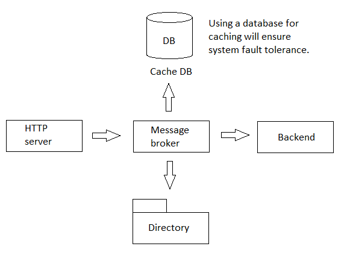
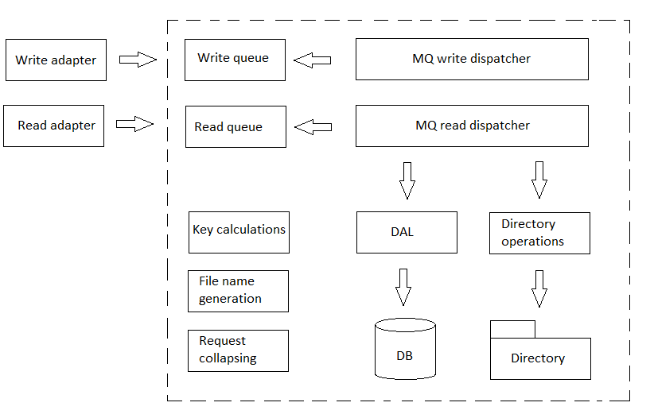

# file-mq-broker

[English](README.md) | [Русский](README.ru.md)

## Описание

Представим себе систему, обрабатывающую входящий HTTP трафик, запрашивая бэкэнд и отдающая его результат в ответе. Общение с бэкэндом нужно спроектировать через файловый брокер сообщений, т.е. API бэкэнда не имеет синхронного API типа "request-reply".

Нужно реализовать две версии, реализующие решение задачи.
- В "наивной" (primitive) реализации системы все входящие запросы поступают в брокер и ожидают ответа от него, который и передают вызывающему.
- В продвинутой (advanced) реализации требуется схлопывать идентичные запросы в один запрос брокеру. Идентичность определяется через функцию, извлекающую из запроса ключ. После процедуры схлопывания (т.е. отсылки ответов вызывающим), следующая пачка "таких же" запросов вновь порождает запрос брокеру.

### Детали реализации

Более подробная диаграмма, демонстрирующая принцип работы файлового брокера сообщений, представлена ниже:

- В качестве брокера использовать директорию, где запрос (method, path) кладется в файл с именем `ключ запроса.req`.
- Ответ брокера ожидается в файле `ключ запроса.resp`, где первой строкой будет HTTP код, а остальное - тело ответа для вызывающего. 
- После вычитки ответа файлы ответа и запроса должны удаляться с диска сервисом.
- Продумать как будет осуществляться смена реализации на "настоящие" брокеры, которые обладают возможностью уведомления клиентов о сообщении в канале (например - любой AMQP брокер).
- Продумать различные варианты ошибок, например: 
    - недоступность брокера (нет каталога в нашей реализации), 
    - таймауты вызывающих (сценарий: два вызывающих с одним запросом с разницей во времени 1 минута, ответ через 1.5 минуты от первого запроса, а таймаут вызывающих - 1 минута), 
    - падение сервиса и его рестарт (очередь можно будет восстановить по записям в БД), 
    - ошибка в формате ответа, 
    - невозможность удаления ответа и/или запроса.
- Расчет ключа для сохранения файла производить по формуле MD5 (HTTP method + HTTP path). Не путать этот ключ с ключем, используемым для схлопывания запросов, поскольку он остается на усмотрение разработчика.
- Ответы могут быть достаточно сильно разнесены по времени с ответом, так, что какой-то из вызывающих, ожидающих ответа, может принудительно со своей стороны разорвать соединение, не дождавшись ответа.
- Настройки брокера в конфиг файле (директория хранилища).

### Способ тестирования

- Будет создаваться нагрузка в 10-20 тыс запросов, пачками по идентичности ключа, также в фоне будут создаваться различные ответы на пачки запросов и анализироваться результаты.
- Логи читаются с stdout.
- Автоматически снимаем метрики по кол-ву потоков (системных) и по деградации по ним и памяти исходя из повышения нагрузки.
- Использование примитивов синхронизации.
- Общее исполнение задачи в коде, применение ООП, возможность расширения/замены "малой кровью" функционала (смена брокера, функций ключей, хранилища настроек).
- (не критично) Наличие юнит тестов.
- (не критично) наличие нагрузочных тестов и бенчмарков.
- Читаемость кода.
