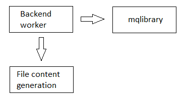

# backendservice

[English](README.md) | [Русский](README.ru.md)

## Architecture

An example backend service architecture is presented below:

### Content generation

Content generation is done as follows:
- Response handler implements a processing method (generating a response and calling an adapter that implements `IWriteAdapter`).
- The delegate (link to the processing method) is stored in `AppInitConfigs`.
- An object of the `AppInitConfigs` class is passed to the constructor of the adapter that implements the `IReadAdapter` interface, and the delegate is saved as a member of the class.
- When an adapter implementing the `IReadAdapter` interface processes a request, a delegate is called to process the request.
