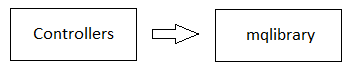

# httpserver

[English](README.md) | [Русский](README.ru.md)

The controller must store the following parameters:
- name of the controller and method (for calculating the HTTP path).
- names of HTTP methods (for example, `GET`, `POST`, `PUT` etc).

Also, the controller must be able to parse the request.
