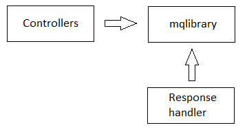

# httpserver

[English](README.md) | [Русский](README.ru.md)

Контроллер должен хранить следующие параметры:
- имя контроллера и метода (для вычисления HTTP path).
- имена HTTP методов (например, `GET`, `POST`, `PUT` etc).

Также контроллер должен уметь парсить запрос.
