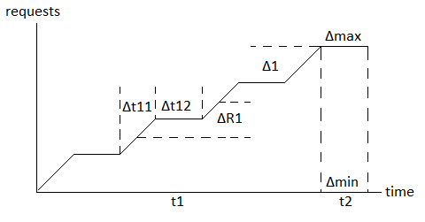

# loadtesting

[English](README.md) | [Русский](README.ru.md)

## Типы тестирования на нагрузку

Возможно выделить несколько типов тестирования на нагрузку:
- повышение
    - разовое
    - нулевая производная
    - постепенное
    - скачкообразное
    - с флуктуациями
- рандомное

### Повышение

Общая диаграмма, иллюстрирующая увеличение количества запросов в зависимости от времени при тестировании на нагрузку, представлена на рисунке ниже:

#### Разовое

#### Нулевая производная

#### Постепенное

#### Скачкообразное

#### С флуктуациями

### Рандомное
